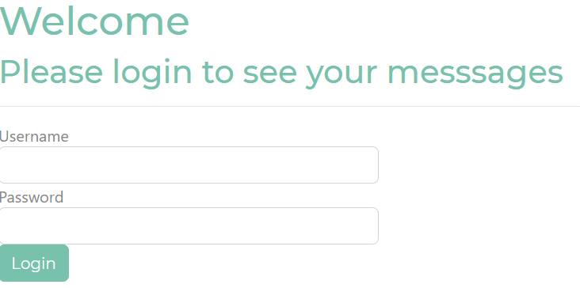
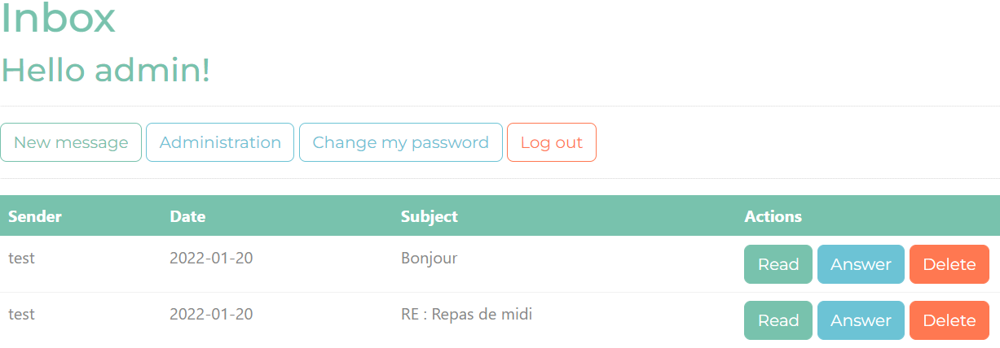
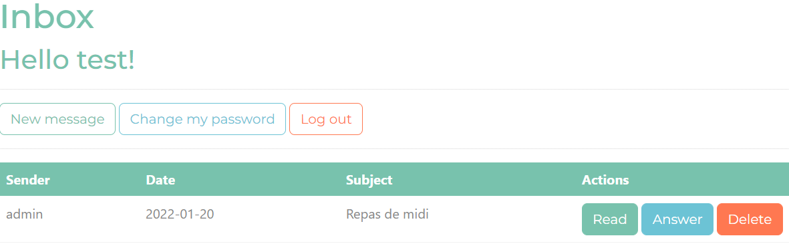
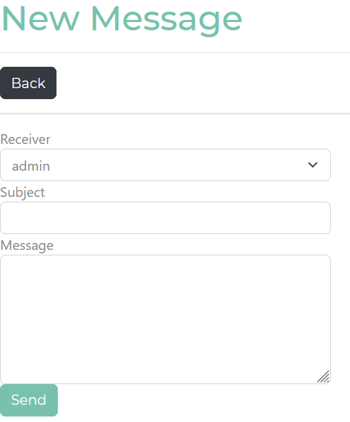
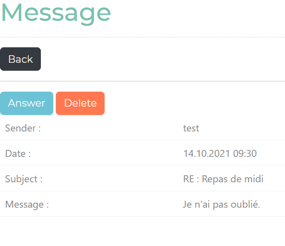
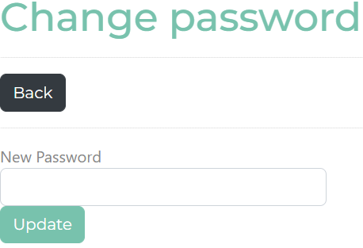
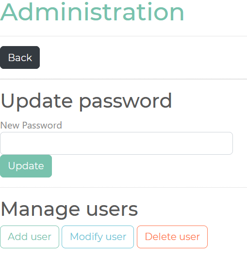
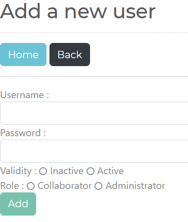
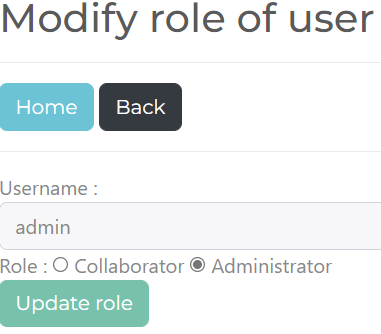
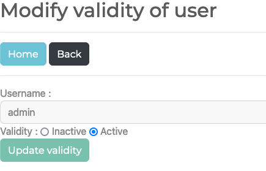

# STI - Projet 2

> Auteurs : Delphine Scherler et Doran Kayoumi
>
> Date : 20.01.2022

Pour exécuter notre projet :

1. Cloner le dossier localement sur votre ordinateur.
2. Démarrer Docker.
3. Ouvrir une fenêtre Git Bash à la racine du projet.
4. Lancer le script suivant dans l’invit Bash : ./docker/install.sh (à faire que la première fois)
5. Accéder à http://localhost:9396/ depuis un navigateur.
6. À tout moment vous pouvez arrêter les containers avec `docker-compose stop` et les redémarrer avec `docker-compose up -d`

## Login

Vous arrivez sur cette page :

Deux utilisateurs sont créés au lancement de l'application :

- Un administrateur
  - username : admin
  - password : admin
- Un collaborateur :
  - username : test
  - password : test

Vous pouvez utiliser l'un d'eux pour vous connecter.

## Inbox

Dès que vous êtes connecté vous allez arriver sur la page principale de la messagerie.

Vue par un administrateur :

Vue par un utilisateur :

Pour la démo, la base de données fournie dans GitHub contient quelques mails.

Depuis cette page vous pouvez :

- Lire, répondre ou supprimer des messages.
- Ecrire un nouveau message.
- Changer votre mot de passe.
- Accéder à la page d'administration, si vous êtes administrateur.
- Vous déconnecter.

## New message / Answer

Voici la page pour écrire un nouveau message :

## Read

Cette page permet de lire le corps du message. Mais également de répondre ou de supprimer celui-ci.

## Change my password

Cette page permet de changer son mot de passe.

## Administration

Cette page est réservée à l'administrateur, elle permet de :

- ajouter de nouveaux utilisateurs
- modifier un utilisateur (mot de passe, rôle, validité)
- supprimer un utilisateur

## Add user

Cette page permet d'ajouter un utilisateur à la base de données.

## Modify role of user

Cette page permet de modifier le rôle d'un utilisateur.

## Modify validity of user

Cette page permet de modifier la validité d'un utilisateur.

(À savoir qu'un comportement bizarre a parfois été observé sur cette page qui nous redirigeais sans raison sur l'Inbox.)

