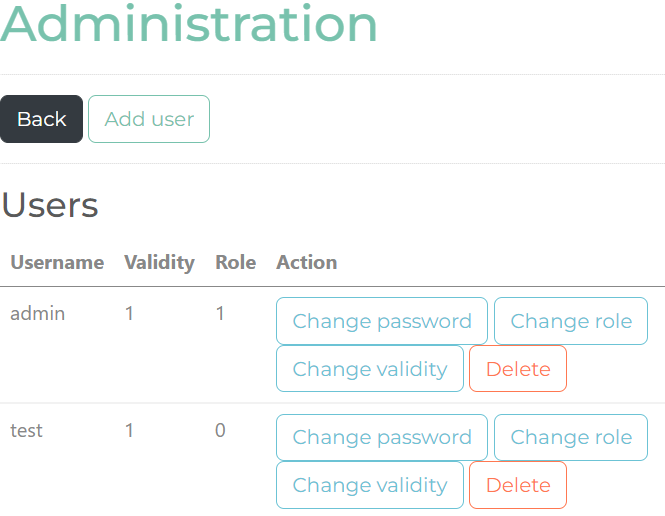
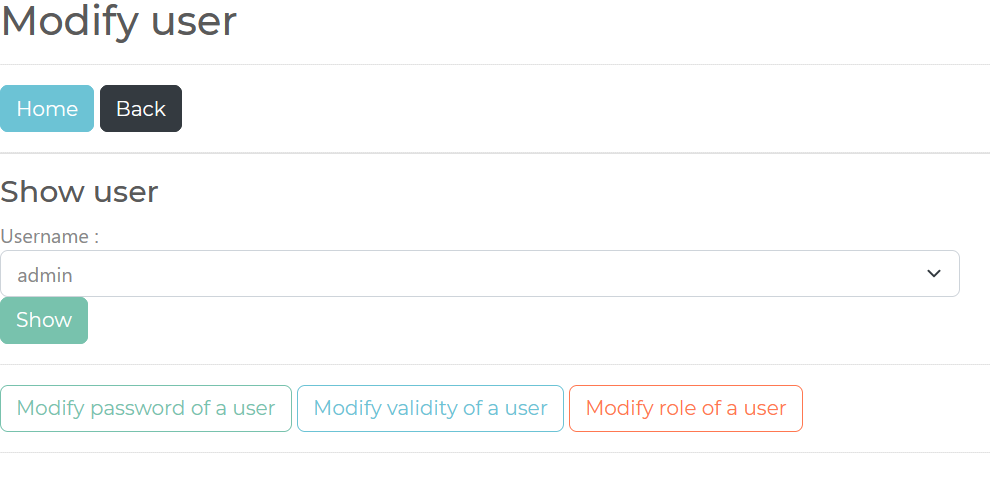

# STI - Projet 1

Pour exécuter notre projet :

1. Cloner le dossier localement sur votre ordinateur.
2. Démarrer Docker.
3. Ouvrir une fenêtre Git Bash à la racine du projet.
4. Lancer le script suivant dans l’invit Bash : ./launch.sh
5. Accéder à http://localhost:9396/ depuis un navigateur.

## Login

Vous arrivez sur cette page :

Deux utilisateurs sont créés au lancement de l'application :
Un administrateur :
	username : admin
	password : admin
Un collaborateur :
	username : test
	password : test

Vous pouvez utiliser l'un d'eux pour vous connecter.

## Inbox

Dès que vous êtes connecté vous allez arriver sur la page principale de la messagerie :

Pour la démo, la base de données fournie dans GitHub contient quelques mails.

Depuis cette page vous pouvez :

- Lire, répondre ou supprimer des messages.
- Ecrire un nouveau message.
- Accéder à la page d'administration.
- Vous déconnecter.

## New message

Voici la page pour écrire un nouveau message :

## Read

Cette page permet de lire le corps du message. Mais également de répondre ou de supprimer celui-ci.

## Administration

Cette page permet pour un utilisateur de :

- modifier son mot de passe

Pour un administrateur de (comme ci-dessous) :

- modifier son mot de passe
- ajouter de nouveaux utilisateurs
- modifier un utilisateur
- supprimer un utilisateur

## Add user

Cette page permet d'ajouter un utilisateur à la base de données.

## Modify user

Cette page permet de :

- Afficher les détails d'un utilisateur
- Modifier le mot de passe d'un utilisateur
- Modifier la validité d'un utilisateur
- Modifier le rôle d'un utilisateur

## Delete user

Cette page permet de choisir un utilisateur et de le supprimer.

